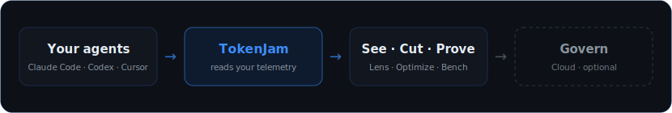

<div align="center">


[](https://github.com/Metabuilder-Labs/tokenjam/actions/workflows/ci.yml)
[](https://pypi.org/project/tokenjam/)
[](https://pypi.org/project/tokenjam/)
[](https://pypi.org/project/tokenjam/)
[](https://www.npmjs.com/package/@tokenjam/sdk)
[](LICENSE)
[](https://opentelemetry.io/docs/specs/semconv/gen-ai/)

**No cloud · No signup · No vendor lock-in**

</div>

---

# Your agents stop repeating their most expensive mistakes.

TokenJam is the self-improvement loop for AI agents: it finds the mistakes your agent keeps
repeating, fixes them, and proves they stopped. It starts with your Claude Code setup and scales to
your production agents.

Think of it as **Sentry for coding-agent behavior, with the fix built in.** Not an observability
tool, not a compressor, not a cost dashboard. It watches how your agent actually works, catches the
blockers it silently re-hits session after session, and closes the loop: propose a fix, you approve
it, it applies reversibly, and it checks whether the mistake actually stopped.

### See it in 30 seconds, no install

```bash
npx tokenjam        # a read-only report of your agent's recurring mistakes. nothing installed, nothing kept
```

Bare `npx tokenjam` reads the Claude Code logs you already have and prints the potholes your agent
keeps driving into. When you want the loop that fixes them, onboard:

```bash
npx tokenjam onboard   # or: pipx install tokenjam && tj onboard
```

`tj onboard` asks how you run AI agents (Claude Code, Codex, or your own SDK / API agents) and wires
the right path. For Claude Code and Codex it backfills your recent history, installs the statusline
and hooks, and ends by showing the mistakes your agent keeps making, then offers to enable your first
fix. Under `npx` it first offers to make itself a permanent install.

TokenJam ingests agent telemetry from many sources (Claude Code sessions, any OTel source) into a
local DuckDB. Local-first, no cloud, no signup.

<sub>`npx tokenjam` and `uvx tokenjam` launch the Python CLI via `uvx`/`pipx` under the hood; see [docs/installation.md](docs/installation.md) for the runner requirements and the full install matrix.</sub>

---

## How the loop works

Five stages, human-gated where it counts.

1. **Detect.** TokenJam reads your Claude Code session transcripts and clusters the blockers your
   agent silently re-hits across sessions: wrong-directory reads, edit-before-read, blocked sleep
   loops, stale-read races, domain-blocked fetches. A pattern has to recur across at least three
   distinct sessions before it becomes a **pothole**.
2. **Propose.** For each pothole TokenJam drafts the lightest fix that could work, on a ladder:
   a **note** appended to your `CLAUDE.md`, then a **skill** (`.claude/skills/<name>/SKILL.md`), then
   a runtime **hook** (or wrapper / config) that catches the mistake as it happens.
3. **Approve.** Nothing is written until you say so. You review the evidence (the repro sessions) and
   the exact diff first.
4. **Apply.** Every write is reversible: snapshotted first, and git-committed when the target is
   tracked, so one revert undoes it. Enforcement rungs (hook / wrapper / config) ship **disabled by
   default** and **fail open**, so a fix can never block a working call or break your loop on
   TokenJam's own bug.
5. **Verify.** TokenJam watches later sessions and reports whether the recurrence actually dropped:
   improved, no change, or regressed. A weak fix (a note that is not landing) gets flagged for you to
   escalate to a stronger rung or revert.

You drive this from three places, no new command to learn: `tj onboard` surfaces your first fix, the
`tj serve` daemon keeps the detector warm and serves the **Review inbox** in Lens (where you approve,
apply, and watch verification), and `tj optimize pothole` prints the current potholes from the CLI.

---

## What the loop is worth

- **Up to 42% of a bad session's tokens** go to repeating known mistakes. TokenJam gets them back.
- **About a dozen known-mistake re-hits a day** on a heavy multi-repo workspace.
- **100% of busy-wait attempts blocked, deterministically.**
- **Incident recovery 18.4% cheaper, measured on 90 days of real sessions.**
- **On one workspace, TokenJam rediscovered 8 of 9 lessons the team had learned the hard way, plus 8
  nobody had noticed.**

---

## Two surfaces, one product

<div align="center"></div>

- **Claude Code, the wedge where the loop runs today.** Detect, propose, approve, apply, verify,
  against your local Claude Code sessions. Fixes land as notes, skills, and hooks in your own config.
  This is the surface that _applies_ fixes.
- **SDK and production agents, over OpenTelemetry, the surface the loop scales to.** Today TokenJam
  **observes** these: traces, real-time cost, drift baselines, sensitive-action alerts, budgets, and
  the six optimize analyzers, all read-only. It never touches your production request stream. The
  Observe suite is where the improvement loop extends next.

Point any OTLP exporter at `tj serve` and production agents flow in with zero code. The self-improve
loop reads Claude Code transcripts; the SDK / OTel path is observe-only for now.

---

## Which path are you?

| You are | Run this | What you get |
|---|---|---|
| **Claude Code user** | `pipx install tokenjam && tj onboard --claude-code` | Backfills your last 30 days, wires a zero-token statusline, runs the self-improve loop plus all six analyzers + Lens |
| **Codex CLI user** | `pipx install tokenjam && tj onboard --codex` | Same onboarding flow, wired for Codex's session logs |
| **Python SDK / API agent dev** | `pipx install tokenjam && tj onboard` + `@watch()` in your code ([Python SDK](docs/python-sdk.md)) | Live capture from your own agent process, observed over the Observe suite |
| **Framework user** (LangChain / CrewAI / AutoGen) | `pip install tokenjam[langchain]` (or `[crewai]` / `[autogen]`) + one `patch_*()` call | Framework-level spans with no manual instrumentation |
| **Already on Langfuse / Helicone** | `tj backfill langfuse --source-url <url> --api-key <key>`<br>(swap `langfuse` → `helicone`, same flags) | One-time import of your existing traces into the local DB |
| **Any OTel-emitting agent** | Point your OTLP exporter at `tj serve` (`http://127.0.0.1:7391/v1/traces`) | Zero-code ingestion: no SDK, no patch |

<sub>The `--claude-code` / `--codex` flags just pre-answer the wizard's first question; bare `tj onboard` asks. `pipx` (not `pip`) sidesteps PEP 668 on Homebrew / Debian / Ubuntu Python.</sub>

LlamaIndex and the OpenAI Agents SDK ship their own native OTel support; point their exporter at
`tj serve` rather than installing an extra. Full matrix: [docs/framework-support.md](docs/framework-support.md).

A single page walks every path, each ending with a verify step: see
[docs/getting-started.md](docs/getting-started.md).

The statusline is **zero-token**: `tj statusline` runs out-of-band each turn (it spends no model
tokens) and shows this session's re-read share with a `/compact` nudge. It does **not** add an in-loop
MCP server (that is an SDK / API surface; an in-loop MCP would tax every turn).

Run bare `tj` any time and it points you to the next best action.

---

## Six analyzers + Lens. One install.

The self-improve loop is the headline. Underneath it, TokenJam reads telemetry from the major agent
runtimes, frameworks, providers, and observability tools and surfaces savings candidates across six
areas, then brings them together in a local browser dashboard.

<div align="center"></div>

<table>
<tr>
<td width="50%" valign="top">

### Downsize

`tj optimize downsize`

Flags sessions where a cheaper same-family model is a downsize candidate. Never claims quality equivalence.

[Details →](docs/optimize/downsize.md)

</td>
<td width="50%" valign="top">

### Cache

`tj optimize cache`

Your caching ratio per (provider, model), plus suggested Anthropic prompt-cache breakpoints from your real usage.

[Details →](docs/optimize/cache.md)

</td>
</tr>
<tr>
<td width="50%" valign="top">

### Script

`tj optimize script`

Deterministic `(tool_name, arg_shape)` sequences that match work a plain script could replace.

[Details →](docs/optimize/script.md)

</td>
<td width="50%" valign="top">

### Trim

`tj optimize trim`

Prompt regions the model gives little weight to. Surfaces what's safe to cut.

[Details →](docs/optimize/trim.md)

</td>
</tr>
<tr>
<td width="50%" valign="top">

### Reuse

`tj optimize reuse`

Sessions where your agent re-plans the same work, exported as reviewable skeleton templates.

[Details →](docs/optimize/reuse.md)

</td>
<td width="50%" valign="top">

### Subagent right-sizing

`tj optimize subagent`

Per-subagent cost breakdown; flags premium-model or over-contexted `Task` calls hidden in the parent total.

[Details →](docs/optimize/subagent.md)

</td>
</tr>
</table>

`tj optimize` (no args) runs every analyzer: the six above, plus `pothole` (the self-improve loop's
detector), `budget-projection` (projects your monthly run-rate against a configured `[budget.<provider>]`
ceiling), and `cache-recommend` (the Cache card's breakpoint-suggestion half). Run a subset with
`tj optimize downsize cache reuse`.

---

## Lens: the local dashboard

`tj serve` runs Lens at `http://127.0.0.1:7391/`. It opens on the **Improve** lens: a **Review inbox**
where the self-improve loop's proposed fixes land for your approval, a Dashboard that lands you on
recurring mistakes and current health, and Status. Flip to the **Observe** lens for Traces, Cost,
Analytics, Alerts, Drift, Optimize, and Budget. Plan-tier-aware, fully offline, no signup.

<table>
<tr>
<td width="50%"></td>
<td width="50%"></td>
</tr>
<tr>
<td width="50%"></td>
<td width="50%"></td>
</tr>
<tr>
<td width="50%"></td>
<td width="50%"></td>
</tr>
</table>

→ [tokenjam.dev/products/lens](https://tokenjam.dev/products/lens) for the visual walkthrough.

---

## The Observe suite

The self-improve loop closes on Claude Code. For every other agent, TokenJam is also a full,
local-first observability stack, the read-only surface the loop scales to.

- **Real-time cost tracking**: every LLM call priced as it happens
- **Safety alerts**: 13 alert types, 6 channels (ntfy, Discord, Telegram, webhook, file, stdout)
- **Behavioral drift detection**: Z-score baselines, no LLM required
- **Schema validation**: declare or infer JSON Schema for tool outputs
- **Context & premium-model audits**: `tj context` (re-read vs. net-new split) and `tj quota-audit`
  (retroactive Opus-usage check) over your Claude Code sessions
- **Close the loop**: `tj loop` annotates a run with a verdict, promotes a bad run into a stored
  expectation, and tracks whether later runs pass or regress against it
- **Prompt summarization (advisory)**: `tj summarize` finds prompt files worth condensing and
  estimates the per-call saving
- **Enforcement-plane proxy (suggest mode)**: `tj proxy` surfaces routing suggestions locally,
  without rewriting requests
- **OTel-native**: point any OTLP exporter at `tj serve` and you're done
- **Statusline**: a zero-token Claude Code status line (`tj statusline`, wired by
  `tj onboard --claude-code`) showing this session's re-read share + a `/compact` nudge
- **MCP server**: in-request-path tools for **SDK / API** users (not Claude Code / Codex subscription
  users, since an in-loop MCP would be a per-turn burden there; they get the out-of-band statusline
  instead)

---

## Prove a swap holds: TokenJam Bench

`tj optimize downsize` flags *candidates*. It never claims the cheaper model would have produced the same answer. **[TokenJam Bench](https://github.com/Metabuilder-Labs/tokenjam-bench)** is the companion that checks. It runs your original and candidate models against real task suites and reports the pass-rate difference with statistics (Wilson CI + McNemar), so you get a hedged verdict ("holds" or "regressed") instead of a guess.

```bash
pip install tokenjam-bench
tjb run --original anthropic:claude-opus-4-7 --candidate anthropic:claude-haiku-4-5
```

Bench reports measured pass-rate on a suite, never "certified" or "quality preserved." Open source and local, like TokenJam. [Learn more →](https://github.com/Metabuilder-Labs/tokenjam-bench)

---

## Documentation

| Topic | Where |
|---|---|
| Getting started: every entry path, by persona | [docs/getting-started.md](docs/getting-started.md) |
| The first hour: what to do once data flows | [docs/first-hour.md](docs/first-hour.md) |
| Full CLI reference, every command and flag | [docs/cli-reference.md](docs/cli-reference.md) |
| Downsize / Cache / Script / Trim deep-dives | [docs/optimize/](docs/optimize/) |
| Reuse analyzer deep-dive | [docs/optimize/reuse.md](docs/optimize/reuse.md) |
| Prove a downsize candidate holds (TokenJam Bench) | [tokenjam-bench](https://github.com/Metabuilder-Labs/tokenjam-bench) |
| Claude Code & Codex integration | [docs/claude-code-integration.md](docs/claude-code-integration.md) |
| Claude Code vs. Codex vs. SDK vs. OTLP: capability matrix | [docs/agent-capability-matrix.md](docs/agent-capability-matrix.md) |
| Harness run grouping (governors / fan-out launchers) | [docs/harness-integration.md](docs/harness-integration.md) |
| Python SDK reference | [docs/python-sdk.md](docs/python-sdk.md) |
| TypeScript SDK reference | [docs/typescript-sdk.md](docs/typescript-sdk.md) |
| Framework support (LangChain / CrewAI / etc.), including the full OTel provider/framework matrix | [docs/framework-support.md](docs/framework-support.md) |
| Alert channels & rule reference | [docs/alerts.md](docs/alerts.md) |
| Backfill from Langfuse / Helicone / OTLP | [docs/backfill/](docs/backfill/) |
| Enforcement-plane proxy (suggest mode) | [docs/proxy/overview.md](docs/proxy/overview.md) |
| Policy rules | [docs/policy/overview.md](docs/policy/overview.md) |
| Configuration | [docs/configuration.md](docs/configuration.md) |
| Architecture deep-dive | [docs/architecture.md](docs/architecture.md) |
| Installation extras (Trim, framework patches) | [docs/installation.md](docs/installation.md) |
| Export to Grafana / Datadog / NDJSON | [docs/export.md](docs/export.md) |
| NemoClaw sandbox observer | [docs/nemoclaw-integration.md](docs/nemoclaw-integration.md) |
| Release notes | [GitHub Releases](https://github.com/Metabuilder-Labs/tokenjam/releases) |

---

## Roadmap

**Shipped:** Self-improve loop (detect, propose, approve, apply, verify, on Claude Code) · Downsize · Cache · Script · Trim · Reuse · Subagent right-sizing · Claude Code + Codex onboarding · MCP server · Lens web UI (Improve + Observe lenses) · Backfill adapters (Langfuse, Helicone, OTLP) · Period comparison · Routing-config export · Read-only policy preview · Context & premium-model audits · Close-the-loop annotations/expectations · Prompt summarization (advisory) · Enforcement-plane proxy (suggest mode)

**Up next** (roughly):
- [ ] Extend the self-improve loop to SDK / production agents over OTel
- [ ] Continued Lens polish + per-product visual branding
- [ ] `tj policy add | edit | apply`: unified rule surface (today: `tj policy list` / `tj policy decisions`)
- [ ] `tj replay`: replay captured sessions against new model versions
- [ ] TypeScript framework patches (LangChain JS, OpenAI Agents SDK)
- [ ] Vercel AI SDK & Mastra integrations
- [ ] Published Docker image
- [ ] GitHub Actions for CI drift/cost checks

Full version-by-version history: [GitHub Releases](https://github.com/Metabuilder-Labs/tokenjam/releases).

---

## Contributing

TokenJam is MIT, and contributions are welcome: from a one-line pricing fix to a whole new framework integration. A few easy on-ramps:

- **[Good first issues →](https://github.com/Metabuilder-Labs/tokenjam/labels/good%20first%20issue)**: scoped, newcomer-friendly tasks, ready to pick up.
- **Bugs**: notice something off? File a bug.
- **Documentation**: struggled with something while getting started? Help the next person by writing or updating documentation.
- **Model pricing**: `tokenjam/pricing/models.toml` is community-maintained. Fix a rate or add a model in a single PR; no issue needed.
- **Framework integrations**: provider/framework patches follow one clear pattern (`tokenjam/sdk/integrations/anthropic.py` is the reference). Open an issue first to align on approach.
- **Coding Agents are first-class citizens**: TokenJam is built by Humans AND AI coding agents, and contributing with one is first-class. **Claude Code:** read [CLAUDE.md](CLAUDE.md) and run `/init` to bring your agent up to speed. **Codex / other agents:** [AGENTS.md](AGENTS.md) has the critical rules.

Setup and the full dev workflow are in **[CONTRIBUTING.md](CONTRIBUTING.md)**.

If TokenJam stops your agents repeating mistakes, **star it** and **watch for releases**; we ship often.

---

<div align="center">

**[tokenjam.dev](https://tokenjam.dev)** · [PyPI](https://pypi.org/project/tokenjam/) · [npm](https://www.npmjs.com/package/@tokenjam/sdk) · [TokenJam Bench](https://github.com/Metabuilder-Labs/tokenjam-bench) · [Issues](https://github.com/Metabuilder-Labs/tokenjam/issues)

MIT License · Built by [Metabuilder Labs](https://github.com/Metabuilder-Labs)

</div>
