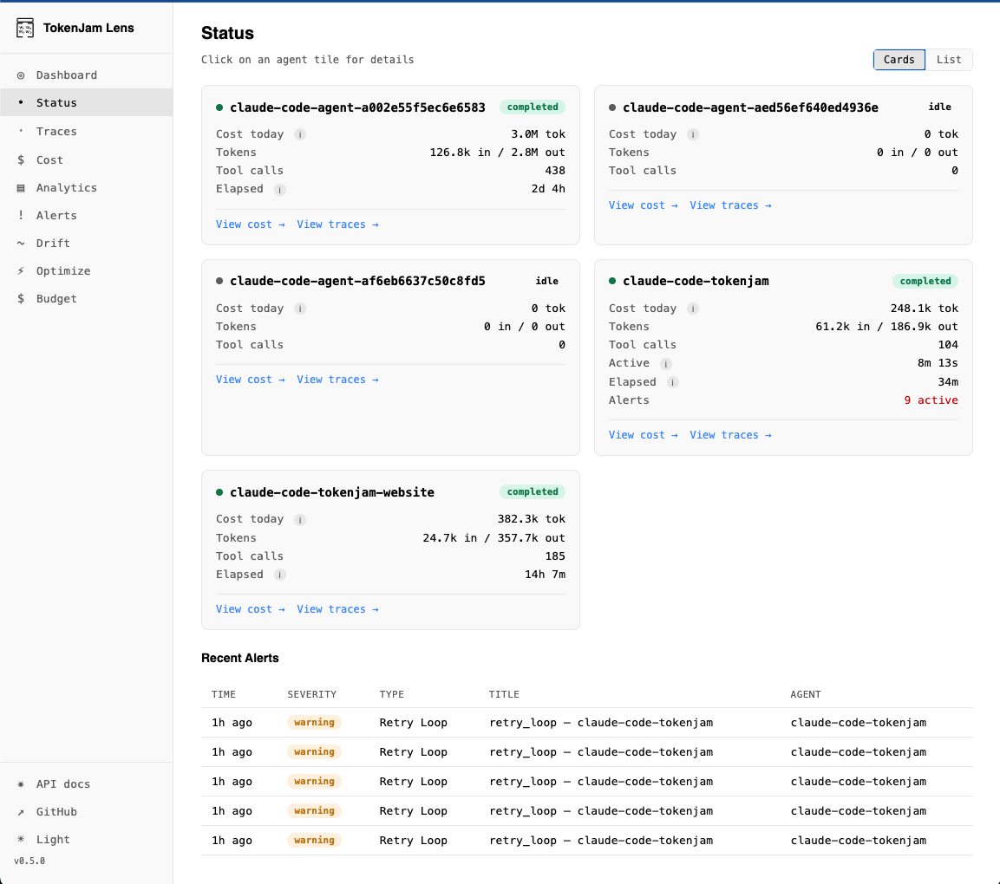
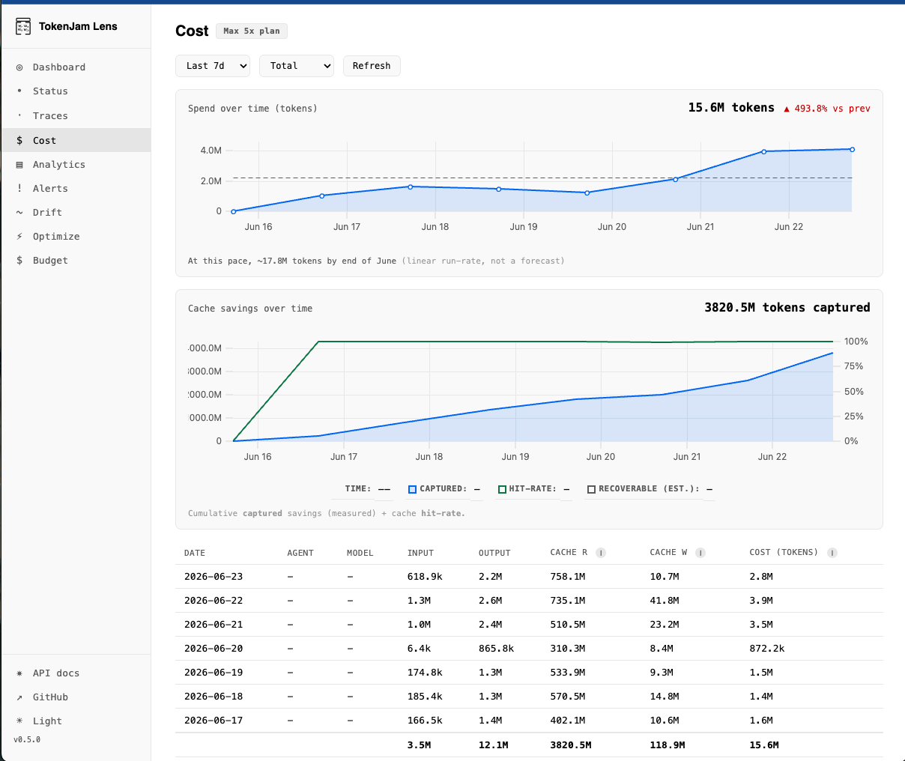
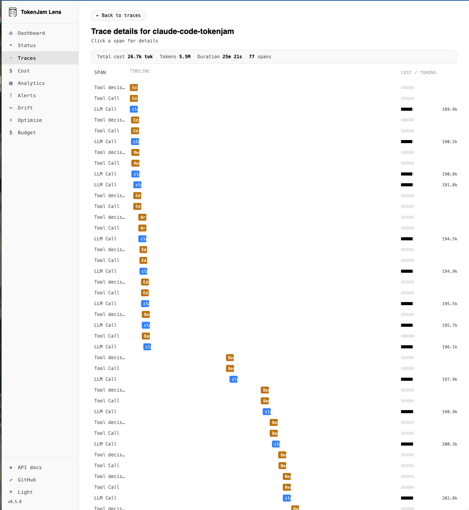
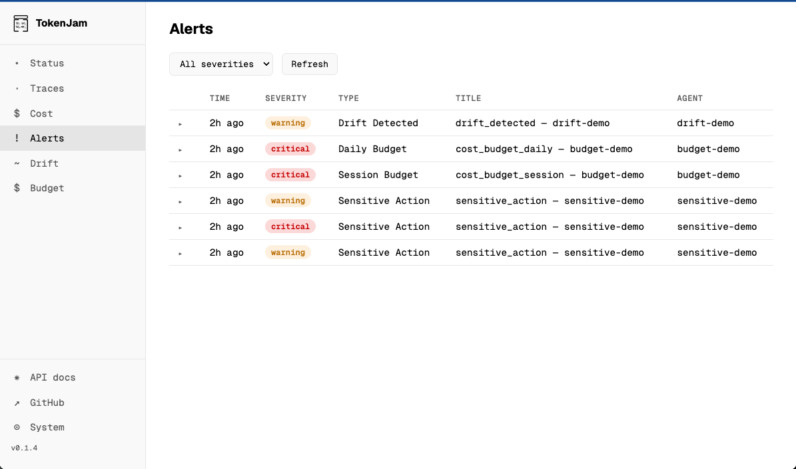

<div align="center">


# TokenJam

### Token Efficiency For AI Agents

TokenJam reads your agent's telemetry and tells you when to downsize, when to trim prompts, what to cache, what to script, and what plans you've already paid to figure out — then shows it all in a local browser dashboard. Runs entirely on your machine.

[](https://github.com/Metabuilder-Labs/tokenjam/actions/workflows/ci.yml)
[](https://pypi.org/project/tokenjam/)
[](https://pypi.org/project/tokenjam/)
[](https://www.npmjs.com/package/@tokenjam/sdk)
[](LICENSE)
[](https://opentelemetry.io/docs/specs/semconv/gen-ai/)

```
pipx install tokenjam
```

<sub>Don't have pipx? `brew install pipx` on macOS, `apt install pipx` on Debian/Ubuntu, or see [docs/installation.md](docs/installation.md). `pip install tokenjam` also works in a clean venv.</sub>

**No cloud · No signup · No vendor lock-in**

</div>

---

## Five Analyzers + Lens. One Install.

TokenJam reads telemetry from every major agent runtime, framework, provider, and observability tool and surfaces savings across five areas — then brings them together in a local browser dashboard.

<table>
<tr>
<td width="50%" valign="top">

### 🪶 Downsize

Flags sessions where a cheaper model in the same family is worth a look. Never claims quality equivalence — surfaces examples so you can spot-check.

<pre><code>tj optimize downsize</code></pre>

[Details →](docs/optimize/downsize.md)

</td>
<td width="50%" valign="top">

### 💾 Cache

Shows your current caching ratio per (provider, model) and suggests Anthropic prompt-cache breakpoints from stable prefixes in your real usage.

<pre><code>tj optimize cache</code></pre>

[Details →](docs/optimize/cache.md)

</td>
</tr>
<tr>
<td width="50%" valign="top">

### 📜 Script

Finds clusters of deterministic `(tool_name, arg_shape)` sequences that match the shape of work a plain script could replace.

<pre><code>tj optimize script</code></pre>

[Details →](docs/optimize/script.md)

</td>
<td width="50%" valign="top">

### ✂️ Trim

Predicts which regions of your prompts the model gives little weight to. Surfaces what's safe to cut.

<pre><code>tj optimize trim</code></pre>

[Details →](docs/optimize/trim.md)

</td>
</tr>
<tr>
<td width="50%" valign="top">

### 🔁 Reuse

Detects clusters of sessions where your agent re-plans the same work and exports reviewable skeleton templates you can drop into a slash command or script.

<pre><code>tj optimize reuse</code></pre>

[Details →](docs/optimize/reuse.md)

</td>
<td width="50%" valign="top">

### 🔭 Lens

A local browser dashboard that brings every analyzer's findings, your real spend, and your alerts together in one place. No cloud, no signup, fully offline.

<pre><code>tj serve</code></pre>

[Details →](https://tokenjam.dev/products/lens)

</td>
</tr>
</table>

Run all five analyzers with `tj optimize`. Run several with `tj optimize downsize cache reuse`.

---

## 30-second quickstart

For **Claude Code** users — zero code, auto-backfills your last 30 days:

```bash
pipx install tokenjam
tj onboard --claude-code
tj optimize          # cost-saving candidates from your actual usage
tj serve             # open the dashboard at http://127.0.0.1:7391/
```

To upgrade later: `pipx upgrade tokenjam` (then `tj stop && tj serve &` to reload the daemon, and `tj --version` to verify). See [docs/installation.md](docs/installation.md#upgrading).

For any Python agent:

```python
from tokenjam.sdk import watch
from tokenjam.sdk.integrations.anthropic import patch_anthropic

patch_anthropic()

@watch(agent_id="my-agent")
def run(task: str) -> str:
    ...
```

→ [Python SDK](docs/python-sdk.md) · [TypeScript SDK](docs/typescript-sdk.md) · [Codex](docs/claude-code-integration.md#codex) · [OTel-compatible agents](docs/framework-support.md)

---

## Lens — the local dashboard

`tj serve` runs Lens at `http://127.0.0.1:7391/`: an Overview triage screen with spend, recoverable waste, and health at a glance; an Optimize tab showing every analyzer's findings side by side; and the standard Status, Traces, Cost, Alerts, Drift, and Budget screens. Plan-tier-aware, fully offline, no signup.

<table>
<tr>
<td width="50%"></td>
<td width="50%"></td>
</tr>
<tr>
<td width="50%"></td>
<td width="50%"></td>
</tr>
</table>

→ [tokenjam.dev/products/lens](https://tokenjam.dev/products/lens) for the visual walkthrough.

---

## Beyond optimization

TokenJam is also a full observability stack. The five analyzers and Lens ride on top.

- **Real-time cost tracking** — every LLM call priced as it happens
- **Safety alerts** — 13 alert types, 6 channels (ntfy, Discord, Telegram, webhook, file, stdout)
- **Behavioral drift detection** — Z-score baselines, no LLM required
- **Schema validation** — declare or infer JSON Schema for tool outputs
- **OTel-native** — point any OTLP exporter at `tj serve` and you're done
- **MCP server** — lets Claude Code query its own telemetry mid-session

---

## CLI

```bash
tj optimize            # all five cost-optimization analyzers
tj optimize downsize   # one analyzer (positional args)
tj tokenmaxx           # shareable spend-tier callout
tj status              # current cost, tokens, active alerts
tj cost --since 7d     # spend by agent / model / day / tool
tj alerts              # everything that fired while you were away
tj drift               # behavioral drift Z-scores
tj report --reuse      # HTML + Markdown skeleton export for the Reuse analyzer
tj backfill claude-code # ingest historical ~/.claude/projects/ sessions
tj serve               # start Lens + REST API
```

[Full CLI reference →](docs/cli-reference.md)

---

## Documentation

| Topic | Where |
|---|---|
| 🪶 Downsize / Cache / Script / Trim deep-dives | [docs/optimize/](docs/optimize/) |
| 🔁 Reuse analyzer deep-dive | [docs/optimize/reuse.md](docs/optimize/reuse.md) |
| Claude Code & Codex integration | [docs/claude-code-integration.md](docs/claude-code-integration.md) |
| Python SDK reference | [docs/python-sdk.md](docs/python-sdk.md) |
| TypeScript SDK reference | [docs/typescript-sdk.md](docs/typescript-sdk.md) |
| Framework support (LangChain / CrewAI / etc.) | [docs/framework-support.md](docs/framework-support.md) |
| Alert channels & rule reference | [docs/alerts.md](docs/alerts.md) |
| Backfill from Langfuse / Helicone / OTLP | [docs/backfill/](docs/backfill/) |
| Configuration | [docs/configuration.md](docs/configuration.md) |
| Architecture deep-dive | [docs/architecture.md](docs/architecture.md) |
| Installation extras (Trim, framework patches) | [docs/installation.md](docs/installation.md) |
| Export to Grafana / Datadog / NDJSON | [docs/export.md](docs/export.md) |
| NemoClaw sandbox observer | [docs/nemoclaw-integration.md](docs/nemoclaw-integration.md) |
| Release notes | [GitHub Releases](https://github.com/Metabuilder-Labs/tokenjam/releases) |

---

## Roadmap

**Shipped in 0.3.x:** Downsize · Cache · Script · Trim · Claude Code + Codex onboarding · MCP server · Web UI · Backfill adapters (Langfuse, Helicone, OTLP) · Period comparison · Routing-config export · Read-only policy preview

**Shipped in 0.4.x:**
- [x] **[TokenJam Lens](https://github.com/Metabuilder-Labs/tokenjam/milestone/1)** — local dashboard rebrand: Overview triage front-door, Optimize detail tab, real spend-over-time charts, cross-screen drill-through
- [x] **[Reuse analyzer](https://github.com/Metabuilder-Labs/tokenjam/milestone/2)** — fifth analyzer: detects clusters of sessions with repeated planning, exports reviewable skeleton templates you can convert into slash commands or scripts
- [x] **Daemon DB concurrency** — per-thread DuckDB cursors so the Overview's fan-out doesn't block on a single shared connection (v0.4.1)
- [x] **Cache cost transparency** — `cache_read` + `cache_write` token columns surfaced in CLI + UI + API (the previously-hidden ~91% cost driver on cache-heavy workloads)

**Up next:**
- [ ] `tj policy add | edit | apply` — unified rule surface
- [ ] `tj replay` — replay captured sessions against new model versions
- [ ] TypeScript framework patches (LangChain JS, OpenAI Agents SDK)
- [ ] Vercel AI SDK & Mastra integrations
- [ ] Docker image
- [ ] GitHub Actions for CI drift/cost checks

---

<div align="center">

**[tokenjam.dev](https://tokenjam.dev)** · [PyPI](https://pypi.org/project/tokenjam/) · [npm](https://www.npmjs.com/package/@tokenjam/sdk) · [Issues](https://github.com/Metabuilder-Labs/tokenjam/issues)

MIT License · Built by [Metabuilder Labs](https://github.com/Metabuilder-Labs)

TokenJam was created by [Anil Murty](https://github.com/anilmurty) — reach him at [anil@metabldr.com](mailto:anil@metabldr.com).

</div>
