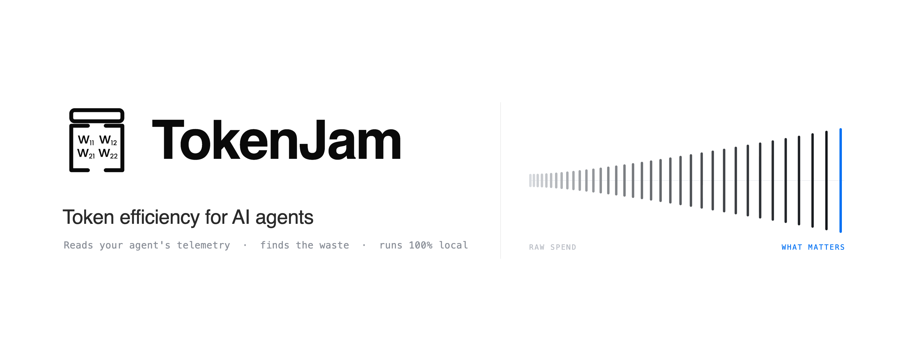
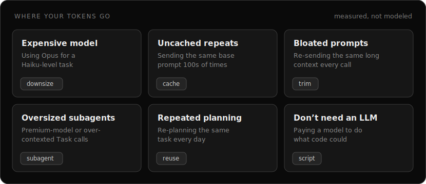
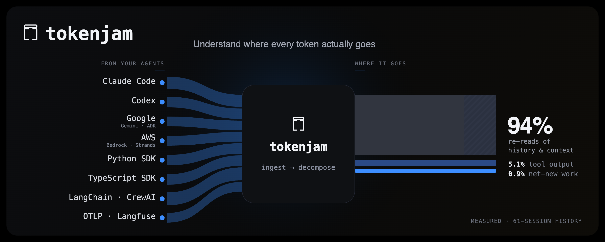

<div align="center">



**See where your agent burns tokens — then cut it.**
Measured from your own telemetry. Runs entirely on your machine.

[](https://github.com/Metabuilder-Labs/tokenjam/actions/workflows/ci.yml)
[](https://pypi.org/project/tokenjam/)
[](https://pypi.org/project/tokenjam/)
[](https://pypi.org/project/tokenjam/)
[](https://www.npmjs.com/package/@tokenjam/sdk)
[](LICENSE)
[](https://opentelemetry.io/docs/specs/semconv/gen-ai/)

**No cloud · No signup · No vendor lock-in**

</div>

<!-- Flow band: the value path, led by the agents a solo dev actually runs. -->
`Claude Code` · `Codex` · `Cursor`  →  **TokenJam**  →  **See** (Lens) · **Cut** (Optimize) · **Prove** (Bench)  →  <sub>Govern (Cloud)</sub>

---

## Where the tokens go

Six ways an agent quietly overspends — each with the analyzer that finds it in *your* data:



<details>
<summary>Same six levers as a table</summary>

| Lever | What it looks like | Analyzer |
|---|---|---|
| **Wrong model** | Opus doing Haiku's job | `downsize` |
| **Uncached repeats** | the same prompt, paid for 40× | `cache` |
| **Bloated prompts** | 10k tokens of dead context every call | `trim` |
| **Verbose output** | 500-word answers to yes/no | `verbosity` <sub>(new)</sub> |
| **Repeated planning** | re-planning the same task daily | `reuse` |
| **Not-even-an-LLM** | a call that's really a regex | `script` |

</details>

---

## See your recoverable spend in one command

```bash
pipx install tokenjam && tj optimize
```

_**measured, not modeled.** TokenJam reads the telemetry you already have and reports `$—/mo · your data` — whatever your own runs actually add up to. No blended averages, no "up to X%," nothing "certified."_

---

## Get started

TokenJam ingests telemetry data about your agents from a multitude of sources and provides you a quick and easy way to visualize and optimize cost so that you get the most out of the tokens you pay for.

One command sets up live capture, all six analyzers, Lens (the local dashboard), and the zero-token statusline:

```bash
npx tokenjam onboard   # or: pipx install tokenjam && tj onboard
```

`tj onboard` asks how you use AI agents (Claude Code, Codex, or your own SDK/API agents) and wires the right path; under npx it first offers to make itself a permanent install. For Claude Code and Codex that means backfilling your recent history plus the statusline and hooks; restart and you're live. Then run:

```bash
tj optimize          # cost-saving candidates from your actual usage
tj serve             # open the dashboard at http://127.0.0.1:7391/
```

The statusline is **zero-token**; `tj statusline` runs out-of-band each turn (no model quota) and shows this session's re-read share with a `/compact` nudge: `◆ Opus 4.8  2.4M tok  🕳️ re-read 95%  → /compact to reclaim quota`. It does **not** add an in-loop MCP server (that's an SDK / API surface; an MCP would tax every turn).

Run bare `tj` any time and it points you to the next best action (`tj status`, `tj tokenmaxx`, `tj optimize`, or `tj serve`).

**Just looking?** `npx tokenjam` prints a 15-second read-only report over the logs you already have: no install, nothing kept.

Building your own agent with the SDK: install *in your project* (`pip install tokenjam` + `tj onboard`); see the table below.

<sub>`npx tokenjam` and `uvx tokenjam` launch the Python CLI via `uvx`/`pipx` under the hood; see [docs/installation.md](docs/installation.md) for the runner requirements and the full install matrix.</sub>

<div align="center"></div>

---

## Which path are you?

| You are | Run this | What you get |
|---|---|---|
| **Claude Code user** | `pipx install tokenjam && tj onboard --claude-code` | Auto-backfills your last 30 days, wires a zero-token statusline, unlocks all six analyzers + Lens |
| **Codex CLI user** | `pipx install tokenjam && tj onboard --codex` | Same onboarding flow, wired for Codex's session logs |
| **Python SDK / API agent dev** | `pipx install tokenjam && tj onboard` + `@watch()` in your code ([Python SDK](docs/python-sdk.md)) | Live capture from your own agent process, no CLI-specific backfill |
| **Framework user** (LangChain / CrewAI / AutoGen) | `pip install tokenjam[langchain]` (or `[crewai]` / `[autogen]`) + one `patch_*()` call | Framework-level spans with no manual instrumentation |
| **Already on Langfuse / Helicone** | `tj backfill langfuse --source-url <url> --api-key <key>`<br>(swap `langfuse` → `helicone`, same flags) | One-time import of your existing traces into the local DB |
| **Any OTel-emitting agent** | Point your OTLP exporter at `tj serve` (`http://127.0.0.1:7391/v1/traces`) | Zero-code ingestion: no SDK, no patch |

<sub>The `--claude-code` / `--codex` flags just pre-answer the wizard's first question; bare `tj onboard` asks.</sub>

LlamaIndex and the OpenAI Agents SDK ship their own native OTel support; point their exporter at `tj serve` rather than installing an extra. Full matrix: [docs/framework-support.md](docs/framework-support.md).

A single page walks every path, each ending with a verify step: see
[docs/getting-started.md](docs/getting-started.md).

---

## Six analyzers + Lens. One install.

TokenJam reads telemetry from the major agent runtimes, frameworks, providers, and observability tools and surfaces savings across six areas. It then brings them together in a local browser dashboard.

<table>
<tr>
<td width="50%" valign="top">

### Downsize

`tj optimize downsize`

Flags sessions where a cheaper same-family model is a downsize candidate. Never claims quality equivalence.

[Details →](docs/optimize/downsize.md)

</td>
<td width="50%" valign="top">

### Cache

`tj optimize cache`

Your caching ratio per (provider, model), plus suggested Anthropic prompt-cache breakpoints from your real usage.

[Details →](docs/optimize/cache.md)

</td>
</tr>
<tr>
<td width="50%" valign="top">

### Script

`tj optimize script`

Deterministic `(tool_name, arg_shape)` sequences that match work a plain script could replace.

[Details →](docs/optimize/script.md)

</td>
<td width="50%" valign="top">

### Trim

`tj optimize trim`

Prompt regions the model gives little weight to. Surfaces what's safe to cut.

[Details →](docs/optimize/trim.md)

</td>
</tr>
<tr>
<td width="50%" valign="top">

### Reuse

`tj optimize reuse`

Sessions where your agent re-plans the same work, exported as reviewable skeleton templates.

[Details →](docs/optimize/reuse.md)

</td>
<td width="50%" valign="top">

### Subagent right-sizing

`tj optimize subagent`

Per-subagent cost breakdown; flags premium-model or over-contexted `Task` calls hidden in the parent total.

[Details →](docs/optimize/subagent.md)

</td>
</tr>
</table>

`tj optimize` (no args) runs every analyzer: the six above, plus `budget-projection` (projects your monthly run-rate against a configured `[budget.<provider>]` ceiling; powers Lens's Budget screen) and `cache-recommend` (the Cache card's breakpoint-suggestion half, above). Run a subset with `tj optimize downsize cache reuse`. Lens brings it all together: see the dashboard below.

---

## Lens: the local dashboard

`tj serve` runs Lens at `http://127.0.0.1:7391/`: a **Dashboard** that lands you on recoverable waste and current health, with an embedded explorer to slice your usage any way (metric × dimension × chart); plus Status, Traces, Cost, Analytics, Alerts, Drift, Optimize, and Budget screens. Plan-tier-aware, fully offline, no signup.

<table>
<tr>
<td width="50%"></td>
<td width="50%"></td>
</tr>
<tr>
<td width="50%"></td>
<td width="50%"></td>
</tr>
<tr>
<td width="50%"></td>
<td width="50%"></td>
</tr>
</table>

→ [tokenjam.dev/products/lens](https://tokenjam.dev/products/lens) for the visual walkthrough.

---

## Beyond optimization

TokenJam is also a full observability stack. The six analyzers and Lens ride on top.

- **Real-time cost tracking**: every LLM call priced as it happens
- **Safety alerts**: 13 alert types, 6 channels (ntfy, Discord, Telegram, webhook, file, stdout)
- **Behavioral drift detection**: Z-score baselines, no LLM required
- **Schema validation**: declare or infer JSON Schema for tool outputs
- **Context & quota audits**: `tj context` (re-read vs. net-new split) and `tj quota-audit` (retroactive Opus usage check) over your Claude Code sessions
- **Close the loop**: `tj loop` annotates a run with a verdict, promotes a bad run into a stored expectation, and tracks whether later runs pass or regress against it
- **Prompt summarization (advisory)**: `tj summarize` finds prompt files worth condensing and estimates the per-call saving
- **Enforcement-plane proxy (suggest mode)**: `tj proxy` surfaces routing suggestions locally, without rewriting requests
- **OTel-native**: point any OTLP exporter at `tj serve` and you're done
- **Statusline**: a zero-token Claude Code status line (`tj statusline`, wired by `tj onboard --claude-code`) showing this session's re-read share + a `/compact` nudge
- **MCP server**: in-request-path tools for **SDK / API** users (not Claude Code / Codex subscription users, since an in-loop MCP would be a per-turn quota burden there; they get the out-of-band statusline instead)

---

## Prove a swap holds: TokenJam Bench

`tj optimize downsize` flags *candidates*. It never claims the cheaper model would have produced the same answer. **[TokenJam Bench](https://github.com/Metabuilder-Labs/tokenjam-bench)** is the companion that checks. It runs your original and candidate models against real task suites and reports the pass-rate difference with statistics (Wilson CI + McNemar), so you get a hedged verdict ("holds" or "regressed") instead of a guess.

```bash
pip install tokenjam-bench
tjb run --original anthropic:claude-opus-4-7 --candidate anthropic:claude-haiku-4-5
```

Bench reports measured pass-rate on a suite, never "certified" or "quality preserved." Open source and local, like TokenJam. [Learn more →](https://github.com/Metabuilder-Labs/tokenjam-bench)

---

## Documentation

| Topic | Where |
|---|---|
| Getting started: every entry path, by persona | [docs/getting-started.md](docs/getting-started.md) |
| The first hour: what to do once data flows | [docs/first-hour.md](docs/first-hour.md) |
| Full CLI reference, every command and flag | [docs/cli-reference.md](docs/cli-reference.md) |
| Downsize / Cache / Script / Trim deep-dives | [docs/optimize/](docs/optimize/) |
| Reuse analyzer deep-dive | [docs/optimize/reuse.md](docs/optimize/reuse.md) |
| Prove a downsize candidate holds (TokenJam Bench) | [tokenjam-bench](https://github.com/Metabuilder-Labs/tokenjam-bench) |
| Claude Code & Codex integration | [docs/claude-code-integration.md](docs/claude-code-integration.md) |
| Claude Code vs. Codex vs. SDK vs. OTLP: capability matrix | [docs/agent-capability-matrix.md](docs/agent-capability-matrix.md) |
| Harness run grouping (governors / fan-out launchers) | [docs/harness-integration.md](docs/harness-integration.md) |
| Python SDK reference | [docs/python-sdk.md](docs/python-sdk.md) |
| TypeScript SDK reference | [docs/typescript-sdk.md](docs/typescript-sdk.md) |
| Framework support (LangChain / CrewAI / etc.), including the full OTel provider/framework matrix | [docs/framework-support.md](docs/framework-support.md) |
| Alert channels & rule reference | [docs/alerts.md](docs/alerts.md) |
| Backfill from Langfuse / Helicone / OTLP | [docs/backfill/](docs/backfill/) |
| Enforcement-plane proxy (suggest mode) | [docs/proxy/overview.md](docs/proxy/overview.md) |
| Policy rules | [docs/policy/overview.md](docs/policy/overview.md) |
| Configuration | [docs/configuration.md](docs/configuration.md) |
| Architecture deep-dive | [docs/architecture.md](docs/architecture.md) |
| Installation extras (Trim, framework patches) | [docs/installation.md](docs/installation.md) |
| Export to Grafana / Datadog / NDJSON | [docs/export.md](docs/export.md) |
| NemoClaw sandbox observer | [docs/nemoclaw-integration.md](docs/nemoclaw-integration.md) |
| Release notes | [GitHub Releases](https://github.com/Metabuilder-Labs/tokenjam/releases) |

---

## Roadmap

**Shipped:** Downsize · Cache · Script · Trim · Reuse · Subagent right-sizing · Claude Code + Codex onboarding · MCP server · Lens web UI · Backfill adapters (Langfuse, Helicone, OTLP) · Period comparison · Routing-config export · Read-only policy preview · Context & quota audits · Close-the-loop annotations/expectations · Prompt summarization (advisory) · Enforcement-plane proxy (suggest mode)

**Up next** (roughly):
- [ ] Continued Lens polish + per-product visual branding
- [ ] `tj policy add | edit | apply`: unified rule surface (today: `tj policy list` / `tj policy decisions`)
- [ ] `tj replay`: replay captured sessions against new model versions
- [ ] TypeScript framework patches (LangChain JS, OpenAI Agents SDK)
- [ ] Vercel AI SDK & Mastra integrations
- [ ] Published Docker image
- [ ] GitHub Actions for CI drift/cost checks

Full version-by-version history: [GitHub Releases](https://github.com/Metabuilder-Labs/tokenjam/releases).

---

## Contributing

TokenJam is MIT, and contributions are welcome: from a one-line pricing fix to a whole new framework integration. A few easy on-ramps:

- **[Good first issues →](https://github.com/Metabuilder-Labs/tokenjam/labels/good%20first%20issue)**: scoped, newcomer-friendly tasks, ready to pick up.
- **Bugs**: notice something off? File a bug.
- **Documentation**: struggled with something while getting started? Help the next person by writing or updating documentation.
- **Model pricing**: `tokenjam/pricing/models.toml` is community-maintained. Fix a rate or add a model in a single PR; no issue needed.
- **Framework integrations**: provider/framework patches follow one clear pattern (`tokenjam/sdk/integrations/anthropic.py` is the reference). Open an issue first to align on approach.
- **Coding Agents are first-class citizens**: TokenJam is built by Humans AND AI coding agents, and contributing with one is first-class. **Claude Code:** read [CLAUDE.md](CLAUDE.md) and run `/init` to bring your agent up to speed. **Codex / other agents:** [AGENTS.md](AGENTS.md) has the critical rules.

Setup and the full dev workflow are in **[CONTRIBUTING.md](CONTRIBUTING.md)**.

If TokenJam saves you tokens, **star it** and **watch for releases**; we ship often.

---

<div align="center">

**[tokenjam.dev](https://tokenjam.dev)** · [PyPI](https://pypi.org/project/tokenjam/) · [npm](https://www.npmjs.com/package/@tokenjam/sdk) · [TokenJam Bench](https://github.com/Metabuilder-Labs/tokenjam-bench) · [Issues](https://github.com/Metabuilder-Labs/tokenjam/issues)

MIT License · Built by [Metabuilder Labs](https://github.com/Metabuilder-Labs)

</div>
