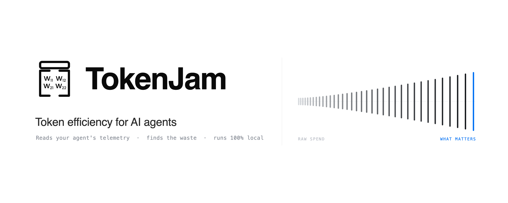
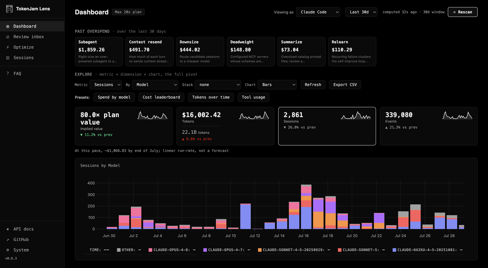
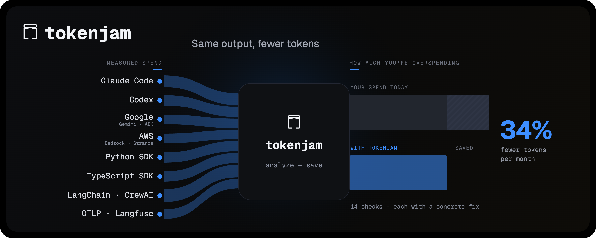
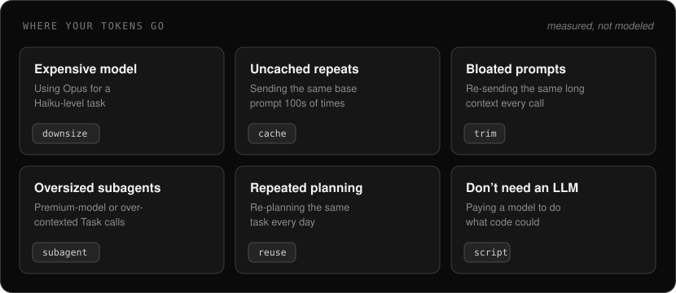

<div align="center">



Reduce token use by up to 40%. TokenJam reads your agent's telemetry, finds overspending, and suggests fixes. Works with Claude Code, Codex, and your own SDK or API agents. Shows it all in a local browser dashboard. Runs entirely on your machine.

[](https://github.com/Metabuilder-Labs/tokenjam/actions/workflows/ci.yml)
[](https://pypi.org/project/tokenjam/)
[](https://pypi.org/project/tokenjam/)
[](https://pypi.org/project/tokenjam/)
[](https://www.npmjs.com/package/@tokenjam/sdk)
[](LICENSE)
[](https://opentelemetry.io/docs/specs/semconv/gen-ai/)

**No cloud · No signup · No vendor lock-in**

</div>

---

TokenJam ingests telemetry data about your agents from a multitude of sources and provides you a quick and easy way to visualize and optimize cost so that you get the most out of the tokens you pay for.

<div align="center">



</div>

---

## Get started

One command sets up live capture:

```bash
npx tokenjam onboard   # or: pipx install tokenjam && tj onboard
```

`tj onboard` asks how you use AI agents and wires that path: live capture, the analyzers your setup can act on, and Lens. Coding-agent users (Claude Code, Codex) also get their recent history backfilled and a zero-token status line wired in; restart the agent and you're live. SDK and API users add `@watch()` to their own code, or point an OTLP exporter at `tj serve`.

Then open the dashboard:

```bash
tj serve   # Lens, at http://127.0.0.1:7391/
```

It opens on your spend so far: which models, which sessions, where it went and proposed fixes. Prefer the terminal?

```bash
tj optimize          # what your usage is costing, and where it is recoverable
tj rules list        # the fixes that came out of it, and the files they'd land in
```

`tj rules list` reads the last analysis, so run it after `tj optimize` or after the daemon's first cycle. Not sure what to do next? Bare `tj` always points at the next useful command.

**Just looking?** `npx tokenjam` prints a read-only report over the logs you already have. No install, nothing kept.

<div align="center"></div>

---

### Claude Code plugin

TokenJam also ships as a Claude Code plugin — see [`plugin/`](plugin/) for the plugin source (`plugin/.claude-plugin/plugin.json`) and install instructions. It adds slash commands that wrap the `tj` CLI; it does not install anything on its own, so `tj` still needs to be on your `PATH` (`npx tokenjam@latest` or `pipx install tokenjam`).

```
/plugin install tokenjam
/onboard    # wires the statusline, resume-brief hook, and local telemetry ingest — same as `tj onboard --claude-code`
/status     # tj status
/optimize   # tj optimize
/doctor     # tj doctor
/uninstall  # tj uninstall --yes
```

The plugin deliberately does not ship its own hooks or an `.mcp.json`: the statusline and hooks are wired by `/onboard` calling the existing, idempotent `tj onboard --claude-code`, so there's exactly one writer of `~/.claude/settings.json`. TokenJam's MCP server (`tj mcp`) also stays opt-in and out of this plugin's default install — it's built for SDK/API integrations that already sit in the request path, not for Claude Code, where an in-loop MCP measurably taxes every turn.

---

## Which path are you?

`tj onboard` is the entry point for everyone; the table is what it wires for each answer. Your answer
also picks your analyzer set, since a coding agent and your own SDK code can change different things.
Most analyzers run for both: [the full split](#the-analyzers) is below.

| You are | Run this | What you get |
|---|---|---|
| **Claude Code user** | `tj onboard` | Backfills your recent history, wires a zero-token status line, unlocks the coding-agent analyzers and Lens |
| **Codex CLI user** | `tj onboard` | Same flow, wired for Codex's session logs |
| **Python SDK / API dev** | `tj onboard`, then `@watch()` in your code ([docs](docs/python-sdk.md)) | Live capture from your own process; no CLI backfill |
| **Framework user** (LangChain / CrewAI / AutoGen) | `pip install tokenjam[langchain]` and one `patch_*()` call | Framework-level spans, no manual instrumentation |
| **Already on Langfuse / Helicone** | `tj backfill langfuse --source-url <url> --api-key <key>` (or `helicone`) | One-time import of your existing traces |
| **Any OTel-emitting agent** | Point your OTLP exporter at `http://127.0.0.1:7391/v1/traces` | Zero-code ingestion: no SDK, no patch |

`--claude-code` and `--codex` pre-answer the wizard's first question for scripts and CI; they are
shortcuts, not separate setups. Run `tj onboard` once inside each project you work in, since sessions
and proposals group per project in Lens, or `tj onboard --add-project` to register another repo
against a setup you already have.

LlamaIndex and the OpenAI Agents SDK ship native OTel support; point their exporter at `tj serve`
instead of installing an extra. Full matrix: [docs/framework-support.md](docs/framework-support.md).
Every path, each ending with a verify step: [docs/getting-started.md](docs/getting-started.md).

---

## The analyzers

TokenJam reads telemetry from the major agent runtimes, frameworks, providers, and observability tools,
then runs a suite of analyzers over it. They are persona-scoped: Coding agent (Claude Code,
Codex), and SDK/API code. `tj optimize` runs everything your persona can act on; name a
subset with `tj optimize downsize resend relearn`.

<div align="center"></div>

| Analyzer | CC | SDK | Description |
|---|:--:|:--:|---|
| `relearn` | ✅ | ✅ | Blockers your agent keeps re-hitting across sessions, and what the repeated recovery costs |
| `resend` | ✅ | ✅ | How much of each turn's prompt is context you already sent, whether or not caching is on |
| `downsize` | ✅ | ✅ | Sessions where a cheaper same-family model is a candidate. Never claims quality equivalence |
| `subagent` | ✅ | — | Per-subagent cost hidden inside the parent session's total, and which dispatches ran over-powered |
| `summarize` | ✅ | — | Agent instruction files (`CLAUDE.md`, `AGENTS.md`, rules, skills, commands) large enough to tax every session, scanned from disk |
| `deadweight` | ✅ | — | MCP servers whose schemas load into every session and are never called |
| `cache` | — | ✅ | Your caching ratio per (provider, model), and where it is worst |
| `cache-recommend` | — | ✅ | Where to place prompt-cache breakpoints, from the prefixes you actually repeat |
| `trim` | — | ✅ | Prompt regions the model gives little weight to |
| `verbosity` | — | ✅ | Sessions whose output runs long against a per-(tool, task-shape) baseline |
| `script` | — | ✅ | Deterministic tool sequences a plain script could replace |
| `reuse` | — | ✅ | Sessions where your agent re-plans work it has already planned |

They find where your agents are overspending. They also tell you where they are not, so you don't spend a week optimizing something that was never costing you anything.

That balance is why some checks stay dark for you: when the lever that would recover a category of spend belongs to your harness rather than to you, quoting the figure only makes you feel worse. A check also stays dark when its evidence does not exist on your setup; `summarize` reads agent instruction files off disk, which an SDK or API workload does not have, so it is not offered there. It is also why a quiet result is an answer rather than a failed scan. Optimizing has a price of its own, paid in your attention and sometimes in the agent's output, and a bill lowered by making your agent terser or dumber was never a saving.

---

## Prove a swap holds: TokenJam Bench

`tj optimize downsize` flags *candidates*. It never claims the cheaper model would have produced the same answer. **[TokenJam Bench](https://github.com/Metabuilder-Labs/tokenjam-bench)** is the companion that checks. It runs your original and candidate models against real task suites and reports the pass-rate difference with statistics (Wilson CI + McNemar), so you get a hedged verdict ("holds" or "regressed") instead of a guess.

```bash
pip install tokenjam-bench
tjb run --original anthropic:claude-opus-4-7 --candidate anthropic:claude-haiku-4-5
```

Bench reports measured pass-rate on a suite, never "certified" or "quality preserved." Open source and local, like TokenJam. [Learn more →](https://github.com/Metabuilder-Labs/tokenjam-bench)

---

## Documentation

| Topic | Where |
|---|---|
| Getting started: every entry path, by persona | [docs/getting-started.md](docs/getting-started.md) |
| The first hour: what to do once data flows | [docs/first-hour.md](docs/first-hour.md) |
| Full CLI reference, every command and flag | [docs/cli-reference.md](docs/cli-reference.md) |
| Downsize / Cache / Script / Trim deep-dives | [docs/optimize/](docs/optimize/) |
| Reuse analyzer deep-dive | [docs/optimize/reuse.md](docs/optimize/reuse.md) |
| Prove a downsize candidate holds (TokenJam Bench) | [tokenjam-bench](https://github.com/Metabuilder-Labs/tokenjam-bench) |
| Claude Code & Codex integration | [docs/claude-code-integration.md](docs/claude-code-integration.md) |
| Claude Code vs. Codex vs. SDK vs. OTLP: capability matrix | [docs/agent-capability-matrix.md](docs/agent-capability-matrix.md) |
| Harness run grouping (governors / fan-out launchers) | [docs/harness-integration.md](docs/harness-integration.md) |
| Python SDK reference | [docs/python-sdk.md](docs/python-sdk.md) |
| TypeScript SDK reference | [docs/typescript-sdk.md](docs/typescript-sdk.md) |
| Framework support (LangChain / CrewAI / etc.), including the full OTel provider/framework matrix | [docs/framework-support.md](docs/framework-support.md) |
| Alert channels & rule reference | [docs/alerts.md](docs/alerts.md) |
| Backfill from Langfuse / Helicone / OTLP | [docs/backfill/](docs/backfill/) |
| Enforcement-plane proxy (suggest mode) | [docs/proxy/overview.md](docs/proxy/overview.md) |
| Policy rules | [docs/policy/overview.md](docs/policy/overview.md) |
| Configuration | [docs/configuration.md](docs/configuration.md) |
| Architecture deep-dive | [docs/architecture.md](docs/architecture.md) |
| Installation extras (Trim, framework patches) | [docs/installation.md](docs/installation.md) |
| Export to Grafana / Datadog / NDJSON | [docs/export.md](docs/export.md) |
| NemoClaw sandbox observer | [docs/nemoclaw-integration.md](docs/nemoclaw-integration.md) |
| Release notes | [GitHub Releases](https://github.com/Metabuilder-Labs/tokenjam/releases) |

---

## Contributing

TokenJam is MIT, and contributions are welcome: from a one-line pricing fix to a whole new framework integration. A few easy on-ramps:

- **[Good first issues →](https://github.com/Metabuilder-Labs/tokenjam/labels/good%20first%20issue)**: scoped, newcomer-friendly tasks, ready to pick up.
- **Bugs**: notice something off? File a bug.
- **Documentation**: struggled with something while getting started? Help the next person by writing or updating documentation.
- **Model pricing**: `tokenjam/pricing/models.toml` is community-maintained. Fix a rate or add a model in a single PR; no issue needed.
- **Framework integrations**: provider/framework patches follow one clear pattern (`tokenjam/sdk/integrations/anthropic.py` is the reference). Open an issue first to align on approach.
- **Coding Agents are first-class citizens**: TokenJam is built by Humans AND AI coding agents, and contributing with one is first-class. **Claude Code:** read [CLAUDE.md](CLAUDE.md) and run `/init` to bring your agent up to speed. **Codex / other agents:** [AGENTS.md](AGENTS.md) has the critical rules.

Setup and the full dev workflow are in **[CONTRIBUTING.md](CONTRIBUTING.md)**.

If TokenJam saves you tokens, **star it** and **watch for releases**; we ship often.

---

<div align="center">

**[tokenjam.dev](https://tokenjam.dev)** · [PyPI](https://pypi.org/project/tokenjam/) · [npm](https://www.npmjs.com/package/@tokenjam/sdk) · [TokenJam Bench](https://github.com/Metabuilder-Labs/tokenjam-bench) · [Issues](https://github.com/Metabuilder-Labs/tokenjam/issues)

MIT License · Built by [Metabuilder Labs](https://github.com/Metabuilder-Labs)

</div>
