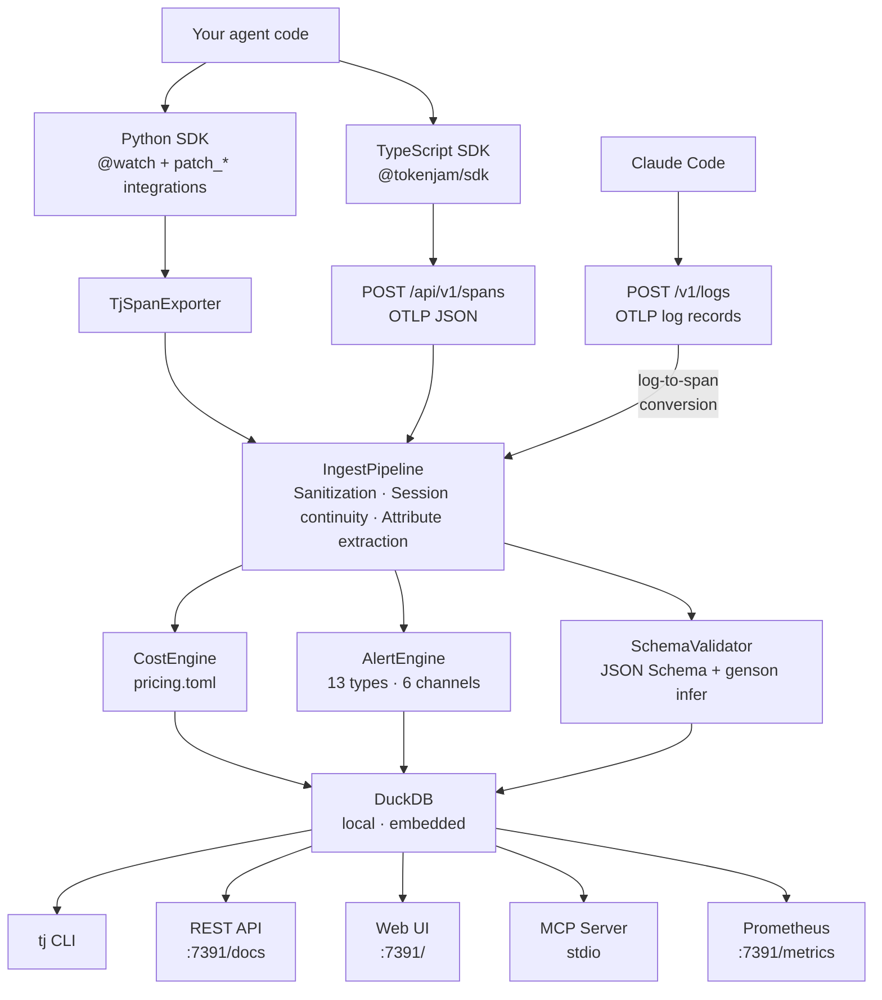

# Architecture

This document describes the architecture of TokenJam (`tj`) — a local-first, OTel-native observability CLI for autonomous AI agents.

## Design principles

1. **Local-first.** All telemetry stays on your machine by default. DuckDB for storage, no cloud backend, no signup. Data only leaves if you explicitly configure an OTLP exporter.

2. **OTel-native.** Spans follow OpenTelemetry GenAI semantic conventions. Any framework that emits OTel spans works out of the box via OTLP. Provider patches exist for frameworks that don't.

3. **Never crash the agent.** The SDK, ingest pipeline, and all post-ingest hooks are designed to fail silently. Hook failures are logged but never propagated. A span rejection never takes down the instrumented agent.

4. **Core is pure domain logic.** `tokenjam/core/` has no CLI or HTTP imports. CLI and API layers import from core, never the reverse. This makes the domain logic independently testable and reusable.

---

## System overview



Three ingest paths, one pipeline. Spans from Python land via the in-process OTel exporter. Spans from TypeScript (or any external process) arrive via HTTP as OTLP JSON. Claude Code emits OTLP log records which are converted to spans at `/v1/logs`. All three paths converge at `IngestPipeline` — everything downstream is identical.

---

## Data flow

### Three ingest paths, one pipeline

All spans converge at `IngestPipeline.process()` regardless of origin:

**Path 1 — In-process (Python SDK):**
`@watch()` + `patch_*()` create OTel spans → `TjSpanExporter` converts `ReadableSpan` to `NormalizedSpan` → `IngestPipeline.process()`

**Path 2 — HTTP spans (external clients):**
TypeScript SDK / OpenClaw / any OTLP client → `POST /api/v1/spans` (or `/v1/traces` for standard OTLP path) → parse OTLP JSON → `IngestPipeline.process()`

**Path 3 — HTTP logs (Claude Code):**
Claude Code emits OTLP log records → `POST /v1/logs` → log-to-span converter maps each event type (`api_request`, `tool_result`, `api_error`, `user_prompt`, `tool_decision`) to a `NormalizedSpan` with deterministic trace/span IDs → `IngestPipeline.process()`

This convergence is deliberate — everything downstream (cost calculation, alerts, schema validation, storage) is identical regardless of how the span arrived.

### Post-ingest hooks

After each span is written to the database, three hooks run synchronously:

1. **CostEngine** — Looks up the model in `pricing/models.toml`, calculates USD cost from token counts, updates `spans.cost_usd` and `sessions.total_cost_usd` in the database. Falls back to default rates ($0.50/$2.00 per MTok) for unknown models.

2. **AlertEngine** — Evaluates per-span rules: sensitive action match, retry loop detection (4+ identical tool calls in last 6 spans), failure rate (>20% errors in last 20 spans), NemoClaw sandbox events. Also evaluates per-session rules at session end: cost budgets and session duration.

3. **SchemaValidator** — If the span is a `gen_ai.tool.call` with captured `gen_ai.tool.output`, validates against declared JSON Schema (from agent config) or inferred schema (from drift baseline). Fires `SCHEMA_VIOLATION` alert on failure.

Hooks are error-tolerant — if any hook fails, the error is logged and the next hook still runs. A hook failure never prevents the span from being stored.

### Session continuity

Sessions are identified by `conversation_id`. When a span arrives with a `conversation_id` that matches an existing session, the span is attributed to that session — even across process restarts. A new `conversation_id` creates a new session. This allows agents that persist conversation IDs (like OpenClaw) to accumulate all their spans in one logical session.

---

## Package structure and dependency rules

```
tokenjam/
├── core/       Pure domain logic — NO imports from cli/ or api/
├── cli/        Click commands — imports from core/
├── api/        FastAPI routes — imports from core/
├── mcp/        MCP server for Claude Code — imports from core/ and api/
├── otel/       OTel SDK wiring — imports from core/
├── sdk/        Python instrumentation SDK — imports from core/ and otel/
│   └── integrations/   Provider and framework patches
├── ui/         Single-file web UI (index.html)
└── utils/      Shared utilities (formatting, time parsing, IDs)
```

The dependency rule is strict: **`core/` is the innermost layer** and must never import from `cli/`, `api/`, or `sdk/`. All other packages can import from `core/`. This keeps the domain logic independently testable.

`otel/semconv.py` is pure constants with zero internal imports — it can be imported by anything without risk of circular dependencies.

`sdk-ts/` is a fully independent TypeScript package that communicates with the Python backend only via HTTP.

---

## Storage layer

### DuckDB (not SQLite)

The database is DuckDB, chosen for its embedded nature (no separate server), columnar storage (good for analytical queries like cost aggregation), and native `TIMESTAMPTZ` and `JSON` column types.

Key schema tables: `spans`, `sessions`, `agents`, `alerts`, `drift_baselines`, `schema_validations`, `schema_migrations`.

### StorageBackend protocol

`StorageBackend` is a Python `Protocol` defining the database interface. Two implementations exist:
- `DuckDBBackend` — production, backed by a file on disk
- `InMemoryBackend` — testing, uses DuckDB with `:memory:` path

The protocol doesn't cover every query. Some callers (e.g., `CostEngine`, `cmd_status`) access `db.conn` directly for queries not in the protocol (cost updates, active session lookups).

### Migrations

Migrations are `(version, sql)` tuples in a `MIGRATIONS` list. The migration runner is idempotent — it checks `schema_migrations` and only applies unapplied versions. Existing migrations must never be modified; only append new ones.

### DuckDB single-writer constraint

DuckDB allows only one write connection. When `tj serve` is running, CLI commands detect the server and route queries through the REST API instead of opening DuckDB directly. This is handled by probing the API endpoint and injecting an `ApiBackend` if the server responds.

---

## SDK architecture

### Bootstrap

`ensure_initialised()` in `tokenjam/sdk/bootstrap.py` is the lazy, thread-safe, idempotent entry point. It bootstraps: config loading → DB connection → IngestPipeline creation → TracerProvider setup. Called automatically by `@watch()` and all `patch_*()` functions. Registers an `atexit` handler to flush pending spans.

### @watch() creates sessions, not LLM spans

A common misconception: `@watch(agent_id="my-agent")` only creates a session-level `invoke_agent` span. Individual LLM call spans require provider patches (`patch_anthropic()`, `patch_openai()`, etc.) or manual calls to `record_llm_call()` / `record_tool_call()`.

### Provider patches

Provider patches monkey-patch LLM client methods to intercept API calls and create OTel spans with token usage attributes. Each patch follows the same pattern:
1. Save the original method
2. Replace with a wrapper that creates a span, calls the original, extracts usage from the response, and sets span attributes
3. Handle both sync and streaming variants
4. `uninstall()` restores the original methods

### LiteLLM double-counting prevention

When both `patch_litellm()` and individual provider patches (e.g., `patch_openai()`) are active, a `contextvars.ContextVar` (`_tj_litellm_active`) prevents double-counted spans. The LiteLLM wrapper sets this var to `True` before calling the underlying provider; inner provider patches check it and skip span creation if active.

### Framework patches vs native OTel

Two integration strategies exist:
- **Monkey-patching** (LangChain, LangGraph, CrewAI, AutoGen): wrap framework base class methods to create spans.
- **Native OTel wrapping** (LlamaIndex, OpenAI Agents SDK): configure the framework's built-in OTel instrumentation to export to `tj serve`. Simpler and more reliable.

---

## Alert system

### 13 alert types

The alert engine evaluates rules after every span ingest. Alert types fall into three categories:

**Cost:** `cost_budget_daily`, `cost_budget_session`
**Behavioral:** `sensitive_action`, `retry_loop`, `token_anomaly`, `session_duration`, `schema_violation`, `drift_detected`, `failure_rate`
**Sandbox (NemoClaw):** `network_egress_blocked`, `filesystem_access_denied`, `syscall_denied`, `inference_rerouted`

### Dispatch and cooldown

`AlertDispatcher` routes fired alerts to 6 channel types: stdout, file, ntfy, webhook, Discord, Telegram. `CooldownTracker` prevents alert storms by suppressing repeat alerts of the same type for the same agent within a configurable window. Suppressed alerts are still persisted to the database but not dispatched.

Content stripping removes `prompt_content`, `completion_content`, `tool_input`, `tool_output` from payloads sent to external channels unless `alerts.include_captured_content = true`. Stdout and file channels always receive the full payload.

### External entry point

`AlertEngine.fire()` is the external entry point used by other modules (SchemaValidator, DriftDetector) to fire alerts they detect, rather than only firing through the internal `evaluate()` method.

---

## Drift detection

### Statistical, not LLM-based

Drift detection is purely statistical — no LLM calls required. It uses Z-scores (standard deviations from the mean) to detect behavioral changes.

### Baseline lifecycle

1. Agent runs N sessions (configurable, default 10)
2. After N completed sessions, `DriftDetector` computes a `DriftBaseline`: mean and stddev of input tokens, output tokens, session duration, tool call count, plus common tool sequences
3. Subsequent sessions are compared against the baseline
4. If any dimension's Z-score exceeds the threshold (default 2.0), or tool sequence Jaccard similarity drops below the threshold, a `DRIFT_DETECTED` alert fires

### Schema inference

When no explicit `output_schema` is declared in agent config, the `SchemaValidator` can use genson to infer a JSON Schema from tool outputs observed in past sessions. This inferred schema is stored in `DriftBaseline.output_schema_inferred`.

---

## REST API

### Two auth layers

1. **Ingest auth (middleware):** `POST /api/v1/spans` requires `Authorization: Bearer <ingest_secret>`. Implemented in `IngestAuthMiddleware` using `JSONResponse` directly — not `HTTPException`, which doesn't propagate correctly from `BaseHTTPMiddleware.dispatch`.

2. **API key auth (dependency):** All GET endpoints use `Depends(require_api_key)`. Only enforced when `api.auth.enabled = true` in config.

### OTLP compatibility

Two ingest endpoints accept the same OTLP JSON format:
- `/api/v1/spans` — the primary endpoint, auth required
- `/v1/traces` — standard OTLP path alias for OpenClaw and other OTLP clients

A stub endpoint at `/v1/metrics` returns 200 OK to prevent noisy warnings from OTLP clients that send all three signal types. `/v1/logs` is **not** a stub — it is the primary ingest path for Claude Code telemetry (see [Claude Code telemetry pipeline](#claude-code-telemetry-pipeline) below).

### Partial failure handling

`POST /api/v1/spans` returns 200 with `ingested`/`rejected` counts even if some spans were rejected. 400 is only returned if the entire body is malformed.

### Route inventory

| Endpoint | Method | Description |
|---|---|---|
| `/api/v1/spans` | POST | OTLP JSON span ingest (auth required) |
| `/api/v1/traces` | GET | Trace listing |
| `/api/v1/cost` | GET | Cost breakdown |
| `/api/v1/tools` | GET | Tool call stats |
| `/api/v1/alerts` | GET | Alert history |
| `/api/v1/alerts/{id}/acknowledge` | PATCH | Acknowledge an alert |
| `/api/v1/drift` | GET | Drift baselines and Z-scores |
| `/api/v1/agents` | GET | Agent registry with first_seen, last_seen, lifetime cost |
| `/api/v1/budget` | GET | Budget defaults and per-agent configured/effective values |
| `/api/v1/budget` | POST | Update budget for defaults or a specific agent |
| `/api/v1/status` | GET | Agent status overview |
| `/v1/traces` | POST | OTLP path alias for external clients |
| `/v1/logs` | POST | Claude Code OTLP log ingest (log-to-span conversion) |
| `/v1/metrics` | POST | Stub (returns 200 OK) |
| `/metrics` | GET | Prometheus text format |

### Prometheus metrics

`GET /metrics` generates Prometheus text format by querying the database on each request, not using the OTel Prometheus exporter. This ensures data accuracy after server restarts, at the cost of performance on large datasets.

---

## Web UI

A single-file SPA (`tokenjam/ui/index.html`) served by `tj serve` at `http://127.0.0.1:7391/`. No build step, no node_modules — vanilla JS with Alpine.js from CDN.

Six views: Status, Traces (with span waterfall visualization), Cost, Alerts, Budget, Drift. Hash-based routing (`/#/status`, `/#/traces`, etc.). The UI consumes the same REST API endpoints as external clients. All views auto-poll (Status at 5s, all others at 10s).

The span waterfall is the primary visualization — horizontal bars positioned on a timeline, color-coded by span kind (agent=green, LLM=blue, tool=orange), with parent-child nesting from `parent_span_id`.

---

## Testing architecture

### Four test layers

| Layer | Directory | What it tests | I/O | Speed |
|---|---|---|---|---|
| Unit | `tests/unit/` | Pure logic (cost calculation, time parsing, config) | None | <1s |
| Synthetic | `tests/synthetic/` | Span injection via factories, ingest pipeline | InMemoryBackend | Fast |
| Agents | `tests/agents/` | Mock agent scenarios, full SDK path | InMemoryBackend + OTel | Fast |
| Integration | `tests/integration/` | CLI + API end-to-end | InMemoryBackend + HTTP | Fast |

A fifth layer (`tests/e2e/`) makes real LLM API calls and is auto-skipped without `TJ_ANTHROPIC_API_KEY`.

### Test infrastructure

- **`tests/factories.py`:** All test spans must be created via factory functions (`make_llm_span`, `make_session`, `make_tool_span`, `make_session_with_spans`). Never construct `NormalizedSpan` directly in tests.

- **`InMemoryBackend`:** DuckDB with `:memory:` path, same schema and queries as production. Fresh instance per test.

- **Stub engines:** `StubCostEngine`, `StubAlertEngine`, `StubSchemaValidator` in `tests/conftest.py` for tests that don't need those hooks.

- **OTel TracerProvider:** Global and set-once per process. In SDK tests, set the provider once at module level (not per-test) and clear spans between tests using a custom `_CollectingExporter`.

- **CLI tests:** Use `click.testing.CliRunner` with `unittest.mock.patch` on `tokenjam.cli.main.load_config` and `tokenjam.cli.main.open_db` to inject test fixtures.

- **API tests:** Use `httpx.AsyncClient` with `httpx.ASGITransport(app=app)` against `InMemoryBackend`.

---

## Configuration

Config is TOML, discovered in order: `tj.toml` → `.tj/config.toml` → `~/.config/tj/config.toml`. Override with `--config` flag or `TJ_CONFIG` env var.

The `TjConfig` dataclass tree in `tokenjam/core/config.py` defines the full hierarchy: agents (with budgets, sensitive actions, drift config, output schema), storage, export (OTLP, Prometheus), alerts (cooldown, channels), security, API, and capture settings.

`tomllib.load()` requires binary mode (`"rb"`) — text mode raises `TypeError` at runtime. The codebase uses conditional imports: `tomllib` (Python 3.11+) or `tomli` (3.10). Writing config uses `tomli_w`.

---

## MCP server (Claude Code integration)

`tj mcp` is a stdio-based MCP (Model Context Protocol) server that gives Claude Code direct access to TokenJam observability data. It exposes 13 tools that Claude Code can call during a session.

### Dual-mode operation

The MCP server operates in one of two modes, chosen automatically at startup:

1. **HTTP proxy mode** (when `tj serve` is running): Routes all queries through the REST API via an `_HttpDB` wrapper. Enables write operations (e.g., `acknowledge_alert`) without DuckDB lock conflicts.

2. **Read-only DuckDB mode** (fallback): Opens the DuckDB file in `read_only=True` mode. All 12 read tools work directly against the database. Slightly faster, but no write operations.

If `tj serve` is not running, `cmd_mcp.py` can auto-start it as a detached subprocess before switching to HTTP mode.

### Tool inventory

| Tool | Purpose |
|---|---|
| `get_status` | Current agent state, tokens, cost, alerts |
| `get_budget_headroom` | Daily/session budget limits vs actual spend |
| `list_agents` | All known agents with lifetime cost |
| `list_active_sessions` | Running sessions across all agents |
| `get_cost_summary` | Cost breakdown by day/agent/model |
| `list_alerts` | Alert history with severity filtering |
| `list_traces` | Recent traces with cost/duration |
| `get_trace` | Full span waterfall for a single trace |
| `get_tool_stats` | Tool call counts and average duration |
| `get_drift_report` | Behavioral drift baseline vs latest session |
| `acknowledge_alert` | Mark alerts as acknowledged (only write operation) |
| `setup_project` | Configure project telemetry tagging |
| `open_dashboard` | Start `tj serve` and open the web UI |

### Acknowledge alert — write path

`acknowledge_alert` is the only write operation. It opens a short-lived read-write DuckDB connection just for the UPDATE, avoiding long-held locks.

---

## Claude Code telemetry pipeline

### Onboard flow (`tj onboard --claude-code`)

The `--claude-code` flag configures the full telemetry pipeline in one command:

1. **Derives agent ID** from the git remote origin name (fallback: folder name), prefixed with `claude-code-`
2. **Writes TokenJam config** to `~/.config/tj/config.toml` (global, shared across all projects) with agent entry and optional daily budget
3. **Updates global Claude settings** (`~/.claude/settings.json`) with OTLP exporter env vars: `CLAUDE_CODE_ENABLE_TELEMETRY=1`, `OTEL_LOGS_EXPORTER=otlp`, endpoint, protocol. On re-runs, always resyncs the `OTEL_EXPORTER_OTLP_HEADERS` auth header to fix 401s without manual setup.
4. **Writes project settings** (`./.claude/settings.json`) with `OTEL_RESOURCE_ATTRIBUTES=service.name={agent_id}` so spans are tagged to the right agent
5. **Updates shell env** (`~/.zshrc`) with Docker-compatible endpoint (`host.docker.internal:{port}`) for harness sessions that can't reach `127.0.0.1`
6. **Registers MCP server** globally via `claude mcp add --scope user tj -- tj mcp`
7. **Installs daemon** by default (launchd on macOS, systemd on Linux) with `--config` baked into the unit file; skip with `--no-daemon`

### Log-to-span conversion

Claude Code emits OTLP log records (not traces). The `POST /v1/logs` endpoint converts them into `NormalizedSpan` objects:

| Claude Code event | Span name | Span kind | Key extractions |
|---|---|---|---|
| `claude_code.api_request` | `gen_ai.llm.call` | CLIENT | tokens, cost, cache, duration, model |
| `claude_code.tool_result` | `gen_ai.tool.call` | INTERNAL | tool_name, success boolean |
| `claude_code.api_error` | `gen_ai.llm.call` | CLIENT | status_code, ERROR status |
| `claude_code.user_prompt` | `invoke_agent` | SERVER | session marker |
| `claude_code.tool_decision` | `tool_decision` | INTERNAL | tool_name, decision_type |

Trace IDs are deterministic: `md5(session.id)` produces a stable 32-char hex trace ID, and `md5(prompt.id)[:16]` produces the span ID. This maintains trace continuity across multiple prompts in a single Claude Code session.

The converted spans flow through the standard `IngestPipeline.process()` path — cost calculation, budget enforcement, drift detection, and alert evaluation all apply identically.

### Semantic conventions (`ClaudeCodeEvents`)

`tokenjam/otel/semconv.py` defines `ClaudeCodeEvents` constants for Claude Code's log event attributes: session context (`session.id`, `prompt.id`, `event.sequence`), API request metrics (`cost_usd`, `duration_ms`, `speed`, token counts), tool result fields (`success`, `error`, `tool_parameters`), and error context (`status_code`, `attempt`).

---

## OTel semconv extensions: `billing_account` and `plan_tier`

TokenJam extends the standard OTel GenAI semconv with two attributes for plan-tier-aware cost rendering. Both live in `TjAttributes` in `tokenjam/otel/semconv.py`:

| Attribute | Constant | Lives on | Set by |
|---|---|---|---|
| `tokenjam.billing_account` | `TjAttributes.BILLING_ACCOUNT` | Spans | Every integration (OTel patches, Claude Code JSONL backfill, OTLP HTTP ingest, OTLP logs ingest, Langfuse/Helicone backfill adapters) |
| `tokenjam.plan_tier` | `TjAttributes.PLAN_TIER` | `SessionRecord` (DB column, not a span attribute) | `IngestPipeline._build_or_update_session` reads `ProviderBudget.plan` for the session's `billing_account` |

### `billing_account`

Provider-only identifier. Valid values: `anthropic`, `openai`, `google`, `bedrock`, `local.ollama`. Distinct from `gen_ai.system` (which can include framework-level wrappers like `litellm` or `langchain`) — `billing_account` is whichever provider actually billed the call.

It is **not** a composite. No API-key fingerprint, no plan tier, no account-name suffix. Multi-key disambiguation is deferred until someone asks for it.

### `plan_tier`

The user's declared plan for the relevant provider. Valid values are enumerated in `VALID_PLAN_TIERS`:

```python
{"api", "pro", "max_5x", "max_20x", "plus", "team", "enterprise", "local", "unknown"}
```

`SUBSCRIPTION_PLAN_TIERS` is a sub-set: the plans where "spend" is a flat fee and the user isn't paying per-token. Renderers branch on this to avoid presenting a per-token dollar "spend" claim against a subscription plan.

### `pricing_mode` derived property

`SessionRecord.pricing_mode` is a derived Python property — **not** a stored DB column. It maps `plan_tier` to one of four rendering modes, evaluated top-to-bottom (first match wins):

1. `local` if `billing_account == "local.ollama"`
2. `subscription` if `plan_tier in SUBSCRIPTION_PLAN_TIERS`
3. `api` if `plan_tier == "api"`
4. `unknown` if `plan_tier == "unknown"`

Renderers (`tj optimize`, `tj cost`, the web UI cost views) read `pricing_mode` and pick the appropriate framing. `tj optimize` suppresses dollar figures entirely when the entire window is `pricing_mode = unknown`.

### Why a session-level column, not a span attribute

`plan_tier` doesn't change call-to-call within a session. Storing it on each span would duplicate the value across thousands of rows and create skew if a provider plan changes mid-session. Storing on `SessionRecord` keeps it normalized and lets analyzers JOIN through to it.

### Backfilled sessions

`SessionRecord.plan_tier` defaults to `unknown` for backfilled rows (no plan signal in the source data). `tj status` surfaces a one-line note when unknown-tier sessions exist; `tj optimize` refuses to render dollar figures for those sessions until the user resolves them via `tj onboard --reconfigure`.

---

## Budget system

### CLI (`tj budget`)

- **Read mode**: displays a table with Scope, Daily, and Session columns for all agents, showing both configured and effective (fallback-applied) values
- **Write mode** (`--agent NAME --daily 5.00 --session 1.00`): updates config on disk, creates agent entry if needed

### API (`GET/POST /api/v1/budget`)

- GET returns `{defaults: {...}, agents: {<id>: {configured, effective}}}` — `configured` is the raw agent override, `effective` has fallbacks applied
- POST updates config on disk for a given scope (`"defaults"` or agent ID)

### Resolution logic (`resolve_effective_budget`)

Each budget field independently falls back to defaults:

```
effective.daily_usd   = agent.daily_usd   ?? defaults.daily_usd
effective.session_usd = agent.session_usd ?? defaults.session_usd
```

This allows per-agent overrides on one field while using defaults for the other. The AlertEngine uses these resolved values for budget enforcement.

---

## Drift CLI (`tj drift`)

Displays behavioral drift baselines and Z-score analysis per agent in a Rich table. For each agent with a computed baseline, it compares the latest completed session against the baseline across five dimensions: input tokens, output tokens, session duration, tool call count, and tool sequence similarity (Jaccard).

Z-scores are color-coded: green (|z| < 1.0), yellow (approaching threshold), red (> threshold, drift detected). Exit code 1 if any agent has drifted (useful for CI gating).

---

## Packaging

- **PyPI package name:** `tokenjam`
- **CLI command:** `tj`
- **Python package directory:** `tokenjam/`
- **Build system:** hatchling, with `[tool.hatch.build.targets.wheel] packages = ["tokenjam"]`
- **npm package:** `@tokenjam/sdk` under `sdk-ts/`
